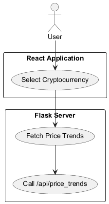
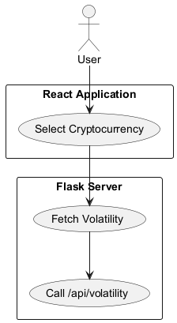
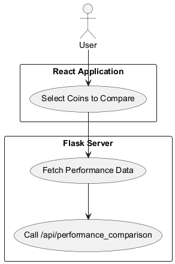
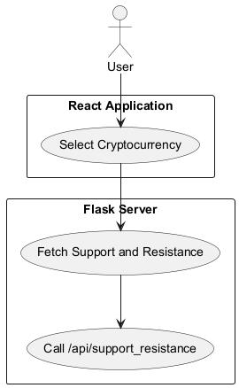
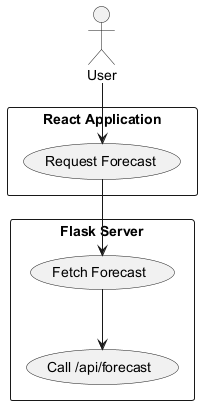

# Solutions Architecture Design Document

## Overview

This document outlines the solutions architecture for the Crypto Intelligence Application, detailing the API routes provided by the Flask server and their corresponding use cases. Each use case diagram illustrates the interactions between the user, the React application, and the Flask server.

## API Routes and Use Cases

### 1. Fetch Price Trends

**Description**: This use case diagram illustrates how users can select a cryptocurrency and fetch its price trends. When a user selects a cryptocurrency, the React application sends a request to the Flask server's `/api/price_trends` endpoint, which retrieves the relevant price data from the database and returns it to the application for display.

### 2. Fetch Volatility

**Description**: This diagram represents the use case for fetching the volatility of a selected cryptocurrency. After the user selects a cryptocurrency, the React application requests volatility data from the Flask server via the `/api/volatility` endpoint. The server calculates the volatility based on historical price data and returns it to the application.

### 3. Performance Comparison

**Description**: This use case diagram illustrates the functionality for comparing the performance of multiple cryptocurrencies. Users can select multiple coins to compare, and the React application sends a request to the Flask server's `/api/performance_comparison` endpoint. The server processes the request and returns the performance data for the selected cryptocurrencies.

### 4. Support and Resistance

**Description**: This diagram represents the use case for fetching support and resistance levels for a selected cryptocurrency. When a user selects a cryptocurrency, the React application requests support and resistance data from the Flask server via the `/api/support_resistance` endpoint. The server retrieves the necessary data from the database and returns the support and resistance levels to the application.

### 5. Forecasting (Placeholder)

**Description**: This use case diagram illustrates the placeholder for the forecasting functionality, which is not yet implemented. Users can request forecasting data, but the current implementation does not provide any forecasting logic. The Flask server responds with a message indicating that the forecasting endpoint is not implemented yet.

## Conclusion

The API routes defined in the Flask server provide essential functionalities for the Crypto Intelligence Application, enabling users to interact with cryptocurrency data effectively. The use case diagrams visually represent the interactions and data flow within the system, aiding in understanding the architecture and design of the application.

This documentation serves as a foundational reference for developers and stakeholders involved in the project, ensuring clarity in the system's design and functionality.
